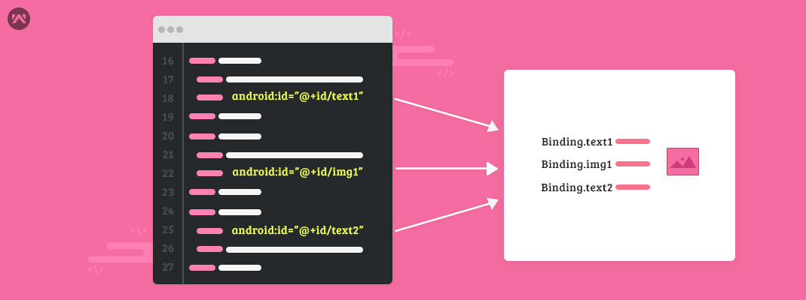
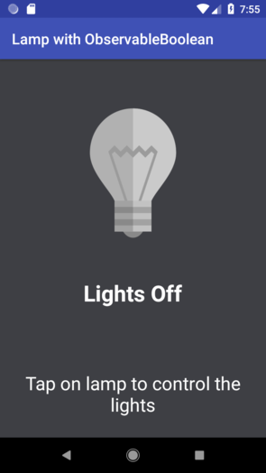

# Android Data Binding

  

## What is this?

This is an example project showing the ways to use [Android Data Binding API](https://developer.android.com/topic/libraries/data-binding/). This project isn't focused in features or layouts, it was coded just for structural and architectural proposes.

## Examples

You can find the following examples:
-   Simple data bindings
-   Click events
-   Observable objects

  
  

## TO DO
-   More examples
-   Kotlin version
